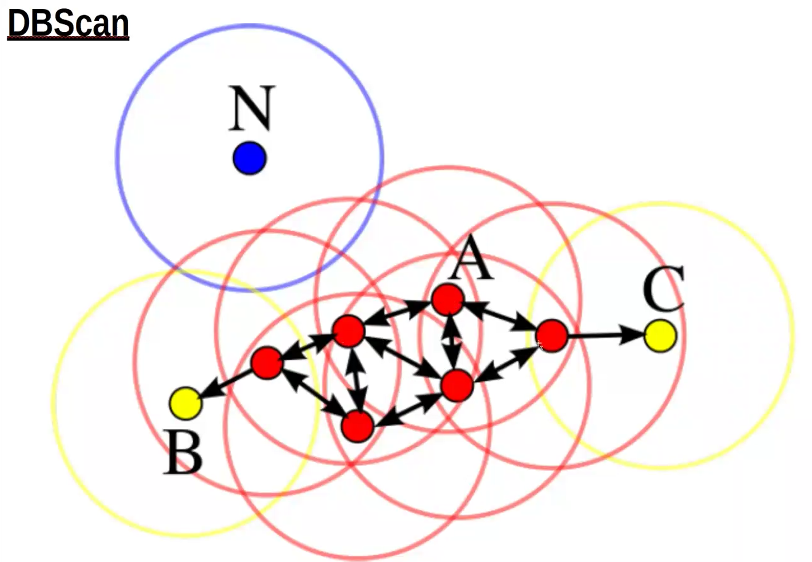
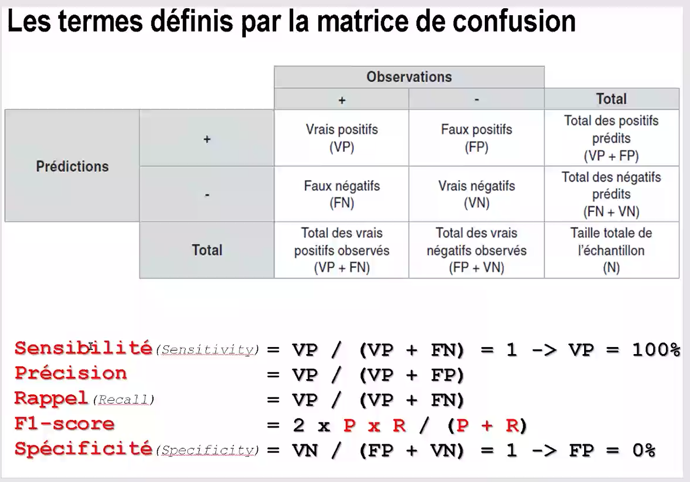
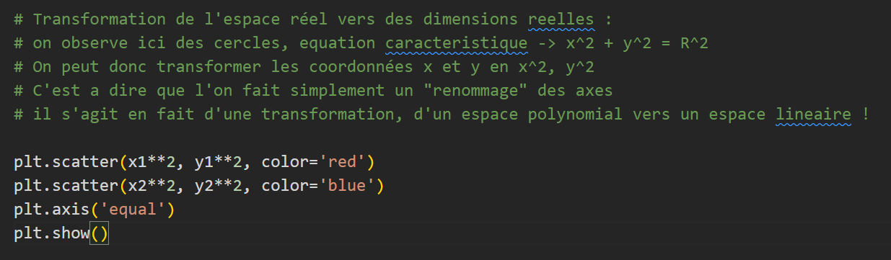
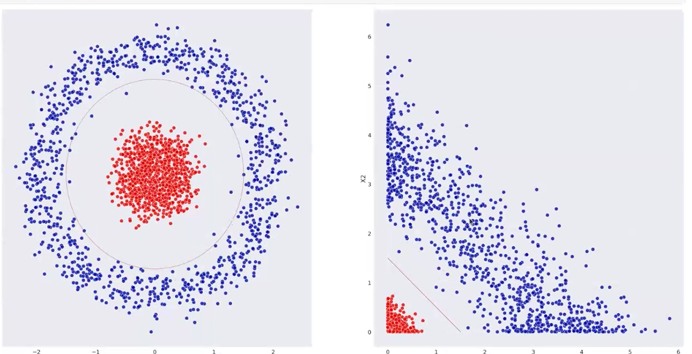

# 🏷️ Les Types de Variables en Machine Learning  

---

## 🔹 1. Variables Qualitatives  

📌 **Définition :**  
Les **variables qualitatives** (ou **catégoriques**) représentent des **informations non numériques** qui décrivent une caractéristique.  

📌 **Exemples :**  
- **Genre** : Homme / Femme / Autre  
- **Couleur préférée** : Rouge, Bleu, Vert  
- **Type de produit** : Thé, Café  

---

## 🔹 2. Variables Ordinales  

📌 **Définition :**  
Les **variables ordinales** sont un **sous-type de variables qualitatives**, mais elles ont **un ordre logique** entre elles.  

📌 **Exemples :**  
- **Niveau d’éducation** : Primaire < Collège < Lycée < Université  
- **Satisfaction client** : Mauvais < Moyen < Bon < Excellent  
- **Taille de vêtements** : S < M < L < XL  

---

## 🔹 3. Variables Quantitatives  

📌 **Définition :**  
Les **variables quantitatives** sont **des nombres** et peuvent être **mesurées ou comptées**.  

📌 **Deux types principaux :**  

### ✅ **Variables Quantitatives Discrètes**  
✔ Valeurs **finies et comptables** (pas de décimales).  
✔ **Exemples** :  
  - Nombre de tasses de café bues par jour ☕  
  - Nombre d'enfants dans une famille 👨‍👩‍👧‍👦  
  - Nombre de produits vendus 🛍️  

### 📏 **Variables Quantitatives Continues**  
✔ **Peuvent prendre une infinité de valeurs dans un intervalle donné** (décimales possibles).  
✔ **Exemples** :  
  - **Taille** (ex: 1,75m) 📏  
  - **Poids** (ex: 72,5 kg) ⚖️  
  - **Âge** (ex: 25,3 ans) 🎂  

---

🎯 **Résumé :**  
- **Qualitatif** → Catégories sans ordre (ex: Couleurs, Produits).  
- **Ordinal** → Catégories avec ordre (ex: Satisfaction, Éducation).  
- **Quantitatif Discret** → Nombre entier comptable (ex: Nombre de cafés).  
- **Quantitatif Continu** → Mesurable avec décimales (ex: Taille, Poids).  

# 🔢 Quand les données quantitatives ne sont pas comparables  

---

## 📌 1️⃣ Centrage et Réduction  

> **Objectif :** Permet de rendre les variables quantitatives comparables, en particulier pour les algorithmes utilisant la **descente de gradient**.  

📌 **Pourquoi c'est nécessaire ?**  
- Certains algorithmes sont sensibles aux **écarts d’échelle** entre les variables (ex: un poids en kg et une distance en km).  
- **Exemple** : Comparer **les choux 🥬 et les carottes 🥕** nécessite une transformation pour ramener toutes les variables à une échelle commune.  
- **Solution** : **Centrer** (moyenne = 0) et **réduire** (écart-type = 1) les variables quantitatives.  

---

## 📌 2️⃣ Analyse en Composantes Principales (ACP)  

> **Objectif :** Réduire la dimensionnalité d’un jeu de données en **conservant un maximum d’information**.  

📌 **Important à savoir** :  
✔ **L’ACP ne fonctionne que sur les variables quantitatives.**  
✔ Elle repose sur des **calculs de moyenne, médiane, écart-type**, qui **n’ont aucun sens mathématique pour les variables qualitatives**.  
✔ Elle permet de **transformer un grand nombre de variables corrélées** en **un petit nombre de nouvelles variables indépendantes**.  

📊 **Exemple d'utilisation :**  
- Simplifier **un grand tableau de données clients** en quelques axes principaux.  
- Faciliter la **visualisation et l’interprétation des données**.  

---

🎯 **Résumé :**  
- **Centrage & Réduction** → Indispensable pour rendre les variables quantitatives comparables, surtout avec des algorithmes basés sur la **descente de gradient**.  
- **ACP** → Utile pour **réduire la dimensionnalité des données**, mais **uniquement applicable aux variables quantitatives**.  

# 🎭 Quand les Variables sont Qualitatives  

---

## 📌 1️⃣ Transformer les Modalités en Valeurs Numériques  

> **Objectif :** Convertir les variables qualitatives en **valeurs exploitables** par les algorithmes de Machine Learning.  

📌 **Exemple : Moyen de paiement, état de santé**  
- Certaines variables comme **le jour de la semaine** peuvent être codées avec des valeurs numériques (**1 à 7** pour Lundi à Dimanche).  
- **Attention ⚠️** : Ces valeurs **n’ont pas de signification mathématique** !  
  - **Jour 1 et Jour 7 ne sont pas plus proches que Jour 1 et Jour 3**.  
  - **(1 - 7) ≠ (15 - 22)** → Ce sont juste des **étiquettes numériques** et non des valeurs ordonnées.  

---

## 📌 2️⃣ Transformation des Modalités en **One-Hot Encoding (Binarisation)**  

> **Objectif :** Représenter chaque modalité comme une **colonne binaire** pour éviter les erreurs d’interprétation des valeurs numériques.  

📌 **Méthode :**  
- Chaque modalité devient une **colonne distincte**.  
- La valeur est **1** si la modalité est présente, **0** sinon.  

📊 **Exemple : Jour de la Semaine**  
| Jour | Lundi | Mardi | Mercredi | Jeudi | Vendredi | Samedi | Dimanche |
|------|-------|-------|----------|-------|----------|--------|---------|
| Mercredi | 0 | 0 | **1** | 0 | 0 | 0 | 0 |
| Samedi | 0 | 0 | 0 | 0 | 0 | **1** | 0 |

✔ **Cette technique est appelée One-Hot Encoding et permet aux modèles d’apprentissage de traiter les variables qualitatives sans biais.**  

---

🎯 **Résumé :**  
- **Conversion en valeurs numériques** → Utilisé pour **représenter des catégories** (ex: jours de la semaine), mais **sans signification mathématique**.  
- **One-Hot Encoding** → Technique qui transforme chaque **modalité en colonne binaire** (ex: un jour spécifique devient une colonne "Samedi" avec des valeurs **0/1**).  

# Les typologie d'algorithme 

## 🧠 Apprentissage Non Supervisé

    L’apprentissage non supervisé permet d’identifier des groupes d’individus similaires sans avoir de classes définies à l’avance.

### 📌 Pourquoi l’utiliser ?

- Quand on a un jeu de **données sans étiquettes et qu’on veut regrouper** des éléments similaires.
- Quand on veut faire du **clustering** (ex: segmentation de clients).
- Quand on veut réduire la dimension des données pour optimiser un modèle.

### 📌 Exemples concrets :

- Un opérateur télécom analyse les achats de ses clients pour proposer des publicités ciblées.
- Une banque détecte des transactions frauduleuses grâce aux comportements anormaux.
- Un site e-commerce classe ses produits en fonction des préférences des clients.

### 📌 Transition vers l’apprentissage supervisé :

- Une fois les données regroupées ou étiquetées, on peut réutiliser ces informations dans un modèle supervisé.
- Cela permet d’améliorer la précision d’un modèle de classification en exploitant les nouveaux groupes détectés.

### 📌 Les algorithmes non supervisés

<table style="border: 1px solid #444; border-collapse: collapse; width: 100%; color: #fff; background-color: #222;">
    <thead>
        <tr style="background-color: #444;">
            <th style="text-align: left; padding: 10px; border: 1px solid #555;">Méthode</th>
            <th style="text-align: left; padding: 10px; border: 1px solid #555;">Utilisation principale</th>
            <th style="text-align: left; padding: 10px; border: 1px solid #555;">Exemples concrets</th>
        </tr>
    </thead>
    <tbody>
        <tr>
            <td style="padding: 10px; border: 1px solid #555; font-weight: bold; color: #ffcc00;">Clustering (K-Means, DBSCAN)</td>
            <td style="padding: 10px; border: 1px solid #555;">Regrouper des individus selon des similarités</td>
            <td style="padding: 10px; border: 1px solid #555;">Segmentation clients, regroupement d’images</td>
        </tr>
        <tr>
            <td style="padding: 10px; border: 1px solid #555; font-weight: bold; color: #66ff99;">Réduction de dimension (PCA, Auto-encodeurs)</td>
            <td style="padding: 10px; border: 1px solid #555;">Réduire le nombre de variables sans perdre trop d’info</td>
            <td style="padding: 10px; border: 1px solid #555;">Compression d’images, visualisation des données</td>
        </tr>
        <tr>
            <td style="padding: 10px; border: 1px solid #555; font-weight: bold; color: #ff6666;">Détection d’anomalies</td>
            <td style="padding: 10px; border: 1px solid #555;">Identifier des valeurs atypiques</td>
            <td style="padding: 10px; border: 1px solid #555;">Détection de fraudes bancaires, pannes machines</td>
        </tr>
    </tbody>
</table>

## Supervisé 

Il y a une colonne X ou Y a expliquer.  

Il y deux type d'algo : 

- **Régression** Y est *quantitatif*

- **Classification** binaire Y est *qualitatif* 

Une modalité c'est la représentation de toute les valeur possible d'une valeur qualitative par Vrai / Faux. En somme on crée une colonne par valeur possible (vert / jaune / rouge) et chaque colonne répond par Vrai ou Faux. Chaque colonne est une modalité. 

## 🧠 Apprentissage Supervisé

    L’apprentissage supervisé est une méthode où le modèle apprend à partir de données étiquetées pour prédire une variable cible Y en fonction des caractéristiques X.

### 📌 Modalités et transformation des données qualitatives :

- Une modalité est une valeur possible d’une variable qualitative (ex: "Rouge", "Vert", "Bleu").
- On utilise One-Hot Encoding pour convertir ces modalités en colonnes binaires (1 = vrai, 0 = faux).
- Cela permet aux algorithmes d’utiliser les données catégorielles efficacement.

### 📌 Types d’algorithmes supervisés

<table style="border: 1px solid #444; border-collapse: collapse; width: 100%; color: #fff; background-color: #222;">
    <thead>
        <tr style="background-color: #444;">
            <th style="text-align: left; padding: 10px; border: 1px solid #555;">Type</th>
            <th style="text-align: left; padding: 10px; border: 1px solid #555;">Explication</th>
            <th style="text-align: left; padding: 10px; border: 1px solid #555;">Exemples</th>
        </tr>
    </thead>
    <tbody>
        <tr>
            <td style="padding: 10px; border: 1px solid #555; font-weight: bold; color: #ffcc00;">Régression</td>
            <td style="padding: 10px; border: 1px solid #555;">Utilisée quand <b>Y est une variable continue (quantitative)</b>.</td>
            <td style="padding: 10px; border: 1px solid #555;">Prédiction du prix d’une maison, estimation du temps de trajet.</td>
        </tr>
        <tr>
            <td style="padding: 10px; border: 1px solid #555; font-weight: bold; color: #ff6666;">Classification</td>
            <td style="padding: 10px; border: 1px solid #555;">Utilisée quand <b>Y est une variable discrète (qualitative)</b>.</td>
            <td style="padding: 10px; border: 1px solid #555;">Classification d’un email (Spam/Non Spam), reconnaissance d’images (Chat/Chien).</td>
        </tr>
    </tbody>
</table>

# 🧩 Algorithmes Non Supervisés  
---
## 🌳 Classification Hiérarchique Ascendante (CHA)  

La **Classification Hiérarchique Ascendante (CHA)** est un **algorithme de clustering** qui regroupe des individus en **fonction de leur similarité**. Il se base sur **la distance entre les différents individus** pour construire un **arbre de regroupement** (**dendrogramme**).  

📌 **Pourquoi utiliser CHA ?**  
- Permet de **visualiser les relations entre les groupes**.  
- Utile pour **déterminer le nombre optimal de clusters**.  
- Adapté aux **petits jeux de données** où les autres méthodes de clustering peuvent être moins efficaces.  

---

## 🔗 1️⃣ Algorithme **Aglomératif** (Regroupement Progressif)  

> **Approche ascendante** : On commence avec chaque individu comme un **groupe distinct**, puis on les **fusionne progressivement** en fonction de leur proximité.  

📌 **Principe :**  
1. On cherche les **deux individus ou groupes les plus proches**.  
2. On les **fusionne** en un seul cluster.  
3. On répète l’opération jusqu'à obtenir **un seul groupe englobant tout le dataset**.  

📏 **Interprétation du dendrogramme :**  
- **La hauteur des branches représente la différence entre les clusters.**  
- **Plus une branche est haute, plus les groupes sont dissemblables.**  
- **On peut couper l’arbre à différentes hauteurs** pour déterminer le **nombre optimal de clusters**.  

💡 **Exemple d’application :**  
> *Regrouper les villes de France selon leur climat et leur population.*  
> → Si on coupe l’arbre en **2 groupes**, on pourrait avoir **régions urbaines vs rurales**.  
> → Mais si on coupe en **6 groupes**, on pourrait distinguer **différentes zones climatiques et économiques**.  

---

## 🔗 2️⃣ Algorithme **Divisif** (Séparation Progressive)  

> **Approche descendante** : On commence avec **un seul grand groupe** contenant tous les individus et on le **divise progressivement** en clusters plus petits.  

📌 **Principe :**  
1. On part d’un **groupe unique avec une forte hétérogénéité**.  
2. On essaye de **trouver des séparations naturelles** dans les données.  
3. On continue jusqu’à obtenir **des sous-groupes homogènes**.  

📌 **Différence avec l’algorithme agglomératif**  
✅ **Aglomératif** : On **assemble** progressivement des clusters.  
✅ **Divisif** : On **divise** un groupe général en sous-groupes.  

🚀 **Pourquoi cet algorithme est rarement utilisé pour le clustering ?**  
- Il est **complexe et coûteux en calcul**.  
- Peu implémenté en pratique pour la segmentation automatique.  
- Mais il est utilisé en **classification supervisée**.  

💡 **Exemple d’application en classification :**  
> *Dans le dépistage du cancer du sein, si une seule variable (ex : taille de la tumeur) permet de séparer **les patients malades et non malades**, alors le problème est résolu.*  

---

## ⚠️ Inconvénients de la Classification Hiérarchique  

❌ **Problème de scalabilité**  
- Ne fonctionne **pas bien sur les grands jeux de données**.  
- **Complexité élevée** : L’algorithme doit comparer **toutes les paires d’individus**, ce qui devient **trop long pour des milliers de points**.  

✅ **Solution alternative :**  
📌 **Utiliser K-Means ou DBSCAN**, qui sont plus rapides et adaptés aux grands volumes de données.  

---

## 🎯 **Résumé**  

<table style="border: 1px solid #444; border-collapse: collapse; width: 100%; color: #fff; background-color: #222;">
    <thead>
        <tr style="background-color: #444;">
            <th style="text-align: left; padding: 10px; border: 1px solid #555;">Méthode</th>
            <th style="text-align: left; padding: 10px; border: 1px solid #555;">Principe</th>
            <th style="text-align: left; padding: 10px; border: 1px solid #555;">Utilisation</th>
        </tr>
    </thead>
    <tbody>
        <tr>
            <td style="padding: 10px; border: 1px solid #555; font-weight: bold; color: #ffcc00;">Aglomératif</td>
            <td style="padding: 10px; border: 1px solid #555;">Regroupe progressivement les individus les plus proches jusqu’à former un unique cluster.</td>
            <td style="padding: 10px; border: 1px solid #555;">Clustering hiérarchique, segmentation de données.</td>
        </tr>
        <tr>
            <td style="padding: 10px; border: 1px solid #555; font-weight: bold; color: #66ff99;">Divisif</td>
            <td style="padding: 10px; border: 1px solid #555;">Sépare un grand groupe en sous-groupes de plus en plus petits.</td>
            <td style="padding: 10px; border: 1px solid #555;">Rare en clustering, mais utilisé en classification.</td>
        </tr>
    </tbody>
</table>

# 🔹 K-Means (Lloyd)

Le **K-Means** est un **algorithme de clustering** qui regroupe les données en **K groupes homogènes**. Il repose sur la notion de **barycentre** et fonctionne de manière itérative pour minimiser la distance intra-classe.  

---

## ⚙️ 1️⃣ Fonctionnement de K-Means  

📌 **Étapes principales :**  
1. **Définir aléatoirement** deux points de départ (appelés **centroïdes**).  
2. **Calculer les distances** de chaque individu par rapport à ces points.  
3. **Déplacer les centroïdes** vers le **barycentre** des classes obtenues.  
4. **Répéter l’opération** jusqu’à ce qu’il n’y ait plus de variation entre deux itérations.  

📌 **Deux versions possibles :**  
- **Démarrage avec 2 individus existants**.  
- **Démarrage avec 2 points totalement aléatoires**.  

🔴 **Problème possible :**  
L’algorithme peut **ne pas converger** si les classes ne sont pas bien définies, ce qui peut le faire **tourner en boucle**.  

---

## 🎯 2️⃣ Déterminer le Nombre Optimal de Classes  

📌 **Méthodes utilisées :**  
1️⃣ **Tester toutes les classifications possibles** et comparer les résultats.  
2️⃣ **Utiliser l’indice de silhouette** pour choisir la meilleure segmentation.  

📌 **Méthode de la silhouette :**  
- Pour **chaque individu**, on calcule :  
  1. La **distance moyenne** entre lui-même et tous les individus de **sa propre classe**.  
  2. La **distance moyenne** entre lui-même et tous les individus d’une **autre classe**.  
- On analyse si un individu **aurait été mieux placé dans une autre classe**.  
- On cherche **où la distance est minimale** :  
  - **Si la distance intra-classe est plus faible** → Bonne classification ✅  
  - **Si la distance avec une autre classe est plus faible** → Mauvaise classification ❌  

---

## ⚠️ 3️⃣ Limites de la Méthode de la Silhouette  

> **La silhouette ne fonctionne pas dans tous les cas !**  

📌 **Cas où elle échoue :**  
- Lorsque les **groupes s’emboîtent** (ex: **des cercles imbriqués**).  
- Dans ces cas, un point en **bordure d’un cercle** sera **plus proche du centre d’un autre cercle** que d’un point éloigné dans son propre cluster.  

📌 **Illustration :**  
  

---

## 🔄 4️⃣ K-Means pour la Réduction de la Complexité  

📌 **Autre usage important :**  
- **K-Means permet de réduire le nombre de valeurs** en diminuant la complexité des données.  
- **Principe** : En **créant des clusters**, on peut **attribuer de nouveaux individus à des groupes prédéfinis**.  
- **Avantage** :  
  - Même si **aucune information n’est créée**, on **ajoute artificiellement des valeurs**, ce qui améliore le comportement des algorithmes de classification.  

---

## 📌 5️⃣ Normalisation des Données  

💡 **Règle fondamentale :**  
✅ **K-Means ne fonctionne bien que sur des colonnes centrées et réduites.**  
✔ Cela évite qu’une **variable avec une échelle plus grande** (ex: **salaire en euros vs âge en années**) **domine le calcul des distances**.  

# 🌐 DBSCAN (Density-Based Spatial Clustering of Applications with Noise)  

Le **DBSCAN** est un algorithme de clustering qui identifie les groupes denses de points dans un espace tout en détectant les **valeurs extrêmes** (outliers). Contrairement à **K-Means**, il **ne nécessite pas de spécifier un nombre de clusters à l'avance** et permet d’identifier des groupes de formes variées.  

---

## ⚙️ 1️⃣ Fonctionnement de DBSCAN  

📌 **Paramètres essentiels :**  
- **ε (epsilon)** → Rayon de la boule autour d’un point.  
- **MinPts (nombre minimum d’individus)** → Nombre d’individus requis dans la boule pour valider un cluster.  

📌 **Processus :**  
1. On place une **boule de rayon ε** autour d'un individu.  
2. Si le nombre d’individus à l’intérieur de cette boule **est supérieur ou égal à MinPts**, le point devient un **point central** d’un cluster.  
3. L’algorithme continue en **expansant la région dense**, en ajoutant les individus voisins au cluster.  
4. **Si un point n’a pas assez de voisins**, il est considéré comme **un outlier (cas extrême)**.  

💡 **Exemple d'exécution :**  
- Le point **A** forme un cluster car il a **3 voisins** dans son rayon ε.  
- Le point **C**, en revanche, **n’a qu’un seul voisin**, donc il **n’est pas inclus dans un cluster**.  

---

## 🚀 2️⃣ Avantages de DBSCAN  

✅ **Identification des valeurs extrêmes**  
- Contrairement à **K-Means**, DBSCAN **ne force pas tous les points à appartenir à un cluster**.  
- Les points isolés sont détectés comme **outliers**, ce qui est utile pour l’analyse d’anomalies.  

✅ **Détection de clusters de formes complexes**  
- DBSCAN peut identifier des **groupes de formes irrégulières**, contrairement à K-Means qui suppose des clusters sphériques.  

✅ **Pas besoin de spécifier le nombre de clusters à l’avance**  
- L’algorithme **décide automatiquement du nombre de clusters** en fonction de la densité locale.  

---

## ⚠️ 3️⃣ Inconvénients et Limites  

❌ **Problème du réglage des paramètres (ε & MinPts)**  
- Une **légère variation** du **rayon ε** ou du **nombre minimal de points** peut entraîner **des résultats très différents**.  
- Définir **ε trop grand** → Les clusters fusionnent.  
- Définir **ε trop petit** → Trop d’outliers sont détectés.  

❌ **Difficile à utiliser sur des jeux de données à densité variable**  
- Si certaines régions ont une **densité élevée** et d’autres une **densité faible**, l’algorithme peut **ne pas bien segmenter** les clusters.  

📌 **Illustration du fonctionnement :**  
  

---

## 🎯 **Résumé : Comparaison avec K-Means**  

<table style="border: 1px solid #444; border-collapse: collapse; width: 100%; color: #fff; background-color: #222;">
    <thead>
        <tr style="background-color: #444;">
            <th style="text-align: left; padding: 10px; border: 1px solid #555;">Critère</th>
            <th style="text-align: left; padding: 10px; border: 1px solid #555;">K-Means</th>
            <th style="text-align: left; padding: 10px; border: 1px solid #555;">DBSCAN</th>
        </tr>
    </thead>
    <tbody>
        <tr>
            <td style="padding: 10px; border: 1px solid #555; font-weight: bold; color: #ffcc00;">Type de clustering</td>
            <td style="padding: 10px; border: 1px solid #555;">Basé sur les centres des clusters (centroïdes).</td>
            <td style="padding: 10px; border: 1px solid #555;">Basé sur la densité des points.</td>
        </tr>
        <tr>
            <td style="padding: 10px; border: 1px solid #555; font-weight: bold; color: #66ff99;">Forme des clusters</td>
            <td style="padding: 10px; border: 1px solid #555;">Plutôt circulaire ou sphérique.</td>
            <td style="padding: 10px; border: 1px solid #555;">Peut détecter des formes complexes.</td>
        </tr>
        <tr>
            <td style="padding: 10px; border: 1px solid #555; font-weight: bold; color: #ff6666;">Gestion des valeurs extrêmes</td>
            <td style="padding: 10px; border: 1px solid #555;">Tous les points doivent être dans un cluster.</td>
            <td style="padding: 10px; border: 1px solid #555;">Les outliers sont détectés et exclus.</td>
        </tr>
        <tr>
            <td style="padding: 10px; border: 1px solid #555; font-weight: bold; color: #6699ff;">Définition du nombre de clusters</td>
            <td style="padding: 10px; border: 1px solid #555;">Doit être fixé à l’avance.</td>
            <td style="padding: 10px; border: 1px solid #555;">Détecté automatiquement.</td>
        </tr>
        <tr>
            <td style="padding: 10px; border: 1px solid #555; font-weight: bold; color: #ff9966;">Difficulté</td>
            <td style="padding: 10px; border: 1px solid #555;">Simple et rapide.</td>
            <td style="padding: 10px; border: 1px solid #555;">Sensibilité au choix des paramètres.</td>
        </tr>
    </tbody>
</table>

---
# 🎯 Les Algorithmes Supervisés  

L’apprentissage **supervisé** consiste à entraîner un modèle sur un **jeu de données étiqueté**, afin qu'il puisse **prédire une classe ou une valeur** à partir de nouvelles données.  

---

## 🔍 1️⃣ Les Plus Proches Voisins (K-Nearest Neighbors - KNN)  

Le **KNN** est un **algorithme de classification** basé sur la **proximité** entre les points. Il attribue **une classe** à un nouvel individu en fonction des **K voisins les plus proches**.  

---

## ⚙️ 2️⃣ Fonctionnement de KNN  

📌 **Principe :**  
1. Définir un **nombre de voisins K**.  
2. Mesurer la **distance** entre le nouvel individu et **tous les autres points** du dataset.  
3. Sélectionner les **K voisins les plus proches**.  
4. L’individu est **classé dans la catégorie majoritaire** parmi ces voisins.  

📌 **Illustration :**  
- Si **K = 3**, on prend les **3 points les plus proches** et on vote pour la classe majoritaire.  
- Si **K = 5**, on prend les **5 plus proches** voisins.  

💡 **Pourquoi est-ce utile ?**  
👉 **Plus K est petit**, plus l'algorithme est sensible au **bruit** et aux outliers.  
👉 **Plus K est grand**, plus la classification est **robuste**, mais moins précise.  

---

## 🚀 3️⃣ Avantages de KNN  

✅ **Simple et intuitif**  
- Facile à comprendre et à implémenter.  
- Pas besoin d’entraîner un modèle complexe.  

✅ **Adapté aux petits jeux de données**  
- Fonctionne bien lorsque le nombre d’échantillons est **faible**.  

✅ **Pas besoin d'hypothèses sur les données**  
- Contrairement à la régression linéaire ou logistique, il **ne suppose pas** de relation mathématique entre les variables.  

---

## ⚠️ 4️⃣ Inconvénients et Limites  

❌ **Lent pour les grandes bases de données**  
- **Chaque nouvelle prédiction** nécessite de **calculer la distance avec tous les points**, ce qui peut être **très coûteux** en temps de calcul.  

❌ **Sensibilité au choix du paramètre K**  
- **Un mauvais choix de K** peut impacter la précision du modèle.  

❌ **Ne fonctionne pas bien si les données ne sont pas bien séparables**  
- Si les **classes se mélangent**, KNN peut **se tromper fréquemment**.  

---

## 🎯 **Résumé : Avantages et Inconvénients de KNN**  

<table style="border: 1px solid #444; border-collapse: collapse; width: 100%; color: #fff; background-color: #222;">
    <thead>
        <tr style="background-color: #444;">
            <th style="text-align: left; padding: 10px; border: 1px solid #555;">Critère</th>
            <th style="text-align: left; padding: 10px; border: 1px solid #555;">Avantages</th>
            <th style="text-align: left; padding: 10px; border: 1px solid #555;">Inconvénients</th>
        </tr>
    </thead>
    <tbody>
        <tr>
            <td style="padding: 10px; border: 1px solid #555; font-weight: bold; color: #ffcc00;">Facilité d’implémentation</td>
            <td style="padding: 10px; border: 1px solid #555;">Simple, intuitif, pas besoin d’entraînement.</td>
            <td style="padding: 10px; border: 1px solid #555;">Lent sur de grands datasets.</td>
        </tr>
        <tr>
            <td style="padding: 10px; border: 1px solid #555; font-weight: bold; color: #66ff99;">Performance</td>
            <td style="padding: 10px; border: 1px solid #555;">Bon pour les petits jeux de données.</td>
            <td style="padding: 10px; border: 1px solid #555;">Inefficace si les données sont mal séparées.</td>
        </tr>
        <tr>
            <td style="padding: 10px; border: 1px solid #555; font-weight: bold; color: #ff6666;">Paramétrage</td>
            <td style="padding: 10px; border: 1px solid #555;">Ne nécessite pas d'hypothèses sur les données.</td>
            <td style="padding: 10px; border: 1px solid #555;">Le choix de K est critique.</td>
        </tr>
    </tbody>
</table>

---

## La régression linéaire 

### Définition

    La régression est une méthode de prédiction utilisée en Machine Learning pour estimer une valeur numérique en fonction d’autres variables.

👉 Objectif : Trouver une relation entre une ou plusieurs variables d’entrée (features) et une variable cible.

### 📌 Quand utiliser la régression linéaire ?

<table style="border: 1px solid #444; border-collapse: collapse; width: 100%; color: #fff; background-color: #222;">
    <thead>
        <tr style="background-color: #444;">
            <th style="text-align: left; padding: 10px; border: 1px solid #555;">Cas d’utilisation</th>
            <th style="text-align: left; padding: 10px; border: 1px solid #555;">Explication</th>
        </tr>
    </thead>
    <tbody>
        <tr>
            <td style="padding: 10px; border: 1px solid #555; font-weight: bold; color: #ffcc00;">Prédire une valeur continue</td>
            <td style="padding: 10px; border: 1px solid #555;">Prix d’une maison, salaire, température.</td>
        </tr>
        <tr>
            <td style="padding: 10px; border: 1px solid #555; font-weight: bold; color: #66ff99;">Relation linéaire entre les variables</td>
            <td style="padding: 10px; border: 1px solid #555;">Si augmenter <b>X</b> augmente <b>Y</b> de manière proportionnelle.</td>
        </tr>
        <tr>
            <td style="padding: 10px; border: 1px solid #555; font-weight: bold; color: #ff6666;">Peu de données, besoin d’un modèle simple</td>
            <td style="padding: 10px; border: 1px solid #555;">Modèle rapide et interprétable.</td>
        </tr>
        <tr>
            <td style="padding: 10px; border: 1px solid #555; font-weight: bold; color: #6699ff;">Comprendre quelles variables influencent Y</td>
            <td style="padding: 10px; border: 1px solid #555;">Identifier les variables importantes avant d’utiliser un modèle plus complexe.</td>
        </tr>
    </tbody>
</table>

✅ Elle optimise les autres algorithmes en aidant à :

    ✔ Sélectionner les meilleures variables.
    ✔ Tester si une relation linéaire existe avant d’appliquer un modèle complexe.
    ✔ Servir de base mathématique pour d’autres modèles (logistique, SVM)

## La régression logistique 

La régression logistique est un algorithme de classification qui permet de prédire une catégorie à partir de données. Contrairement à la régression linéaire (qui prédit une valeur continue), la régression logistique prédit une probabilité et attribue une classe (ex: "Oui" ou "Non", "Spam" ou "Non-Spam", etc.).

💡 Exemples concrets : 

    ✔ Détecter un spam : Est-ce qu’un email est "Spam" ou "Non Spam" ?

    ✔ Diagnostic médical : Un patient est-il malade (1) ou en bonne santé (0) ?

    ✔ Prédiction d’achat : Un utilisateur va-t-il acheter un produit (Oui/Non) ?

✅ Avantages :

    ✔ Simple à comprendre et rapide à entraîner.
    ✔ Fournit une probabilité, utile pour ajuster les seuils.
    ✔ Fonctionne bien sur des petits jeux de données.

❌ Limites :

    ❌ Ne fonctionne que pour deux catégories (mais il existe des extensions pour plusieurs classes).
    ❌ Suppose que les données sont bien séparables (si ce n’est pas le cas, un SVM ou un réseau de neurones est plus adapté).

## Les arbres de décision  

💡 Comment ça marche ?

- L’algorithme analyse colonne par colonne pour identifier celle qui sépare le mieux les données selon la variable cible (ex: espèce d’un animal, achat ou non d’un client).
- Il construit ensuite une arborescence avec des questions successives qui mènent à une décision finale.

📌 Paramétrage :

- On peut limiter la profondeur de l’arbre pour éviter le sur-apprentissage.
- Un arbre trop profond est trop précis sur l’entraînement mais généralise mal.

📌 Problèmes :

    1️⃣ Sur-apprentissage : Trop de découpages, ne fonctionne bien que sur l’entraînement.

    2️⃣ Prise de décision une variable à la fois : Ne combine pas plusieurs colonnes en même temps.

    3️⃣ Gestion des variables qualitatives : Besoin de transformer les catégories en valeurs numériques.

📌 Comment réduire le sur-apprentissage ?

- Limiter la profondeur de l’arbre.
- Méthodes d’ensemble (Ensemble Learning) :
    - Tree Bagging (moyenne plusieurs arbres).
    - Random Forest (arbres construits en parallèle).
    - Boosting (arbres construits en série, plus lent mais plus précis).

 # 🎯 Apprentissage en Machine Learning  

L'apprentissage en Machine Learning consiste à **entraîner un modèle** pour qu'il puisse **faire des prédictions précises** sur de nouvelles données.  

📌 **Problème central :**  
Il faut trouver un **équilibre** entre **un modèle trop simple** (qui ne capture pas bien les tendances) et **un modèle trop complexe** (qui s’adapte trop aux données d’entraînement mais généralise mal).  

---

## ⚙️ 1️⃣ Séparer les Données en Apprentissage & Test  

📌 **Pourquoi ?**  
- **Évaluer la performance réelle de notre modèle**.  
- **Vérifier s'il peut bien généraliser** à de nouvelles données.  

📌 **Comment faire ?**  
1. **Découper le dataset** en deux parties :  
   - **Ensemble d'apprentissage (Training Set) 🏋️‍♂️** : Utilisé pour **entraîner le modèle**.  
   - **Ensemble de test (Test Set) 🧪** : Utilisé pour **évaluer sa performance**.  
2. **Optionnel : Un ensemble de validation** pour ajuster les hyperparamètres.  

💡 **Bonne pratique :**  
Généralement, on utilise **80% des données pour l’entraînement** et **20% pour le test**.  

---

## 🎯 2️⃣ Complexité et Sur-Apprentissage  

📌 **La complexité du modèle :**  
- Un modèle **simple** (ex: une droite) peut **ne pas capturer toutes les tendances**.  
- Un modèle **trop complexe** (ex: une courbe qui passe par tous les points) peut **mémoriser chaque point mais ne pas bien généraliser**.  

📌 **Impact de la complexité :**  
✔ **Augmenter la complexité d’un modèle** peut conduire à **un taux de réussite de 100% sur les données d’entraînement**.  
❌ Mais cela **ne garantit pas de bonnes prédictions** sur de nouvelles données.  

---

## 🔄 3️⃣ Généralisation du Modèle  

> **Un bon modèle ne doit pas juste apprendre les données d’entraînement, mais aussi être capable de généraliser.**  

📌 **Si le modèle est trop complexe** → Il apprend **chaque détail des données d’entraînement** mais **ne sait pas s’adapter aux nouvelles données**.  

📌 **Si le modèle est trop simple** → Il **ne capture pas bien les tendances** et fait des prédictions médiocres.  

💡 **L’objectif est de trouver un équilibre** entre **biais et variance**.  

---

## 📊 4️⃣ Sur-Apprentissage (Overfitting) vs Sous-Apprentissage (Underfitting)  

<table style="border: 1px solid #444; border-collapse: collapse; width: 100%; color: #fff; background-color: #222;">
    <thead>
        <tr style="background-color: #444;">
            <th style="text-align: left; padding: 10px; border: 1px solid #555;">Type d’apprentissage</th>
            <th style="text-align: left; padding: 10px; border: 1px solid #555;">Biais</th>
            <th style="text-align: left; padding: 10px; border: 1px solid #555;">Variance</th>
            <th style="text-align: left; padding: 10px; border: 1px solid #555;">Conséquence</th>
        </tr>
    </thead>
    <tbody>
        <tr>
            <td style="padding: 10px; border: 1px solid #555; font-weight: bold; color: #ff6666;">Sur-Apprentissage (Overfitting) 🔴</td>
            <td style="padding: 10px; border: 1px solid #555; color: #66ff99; font-weight: bold;">Faible ✅</td>
            <td style="padding: 10px; border: 1px solid #555; color: #ff6666; font-weight: bold;">Élevée ❌</td>
            <td style="padding: 10px; border: 1px solid #555;">Le modèle s’adapte trop aux données d’apprentissage mais <b>ne généralise pas</b>.</td>
        </tr>
        <tr>
            <td style="padding: 10px; border: 1px solid #555; font-weight: bold; color: #6699ff;">Sous-Apprentissage (Underfitting) 🔵</td>
            <td style="padding: 10px; border: 1px solid #555; color: #ff6666; font-weight: bold;">Élevé ❌</td>
            <td style="padding: 10px; border: 1px solid #555; color: #66ff99; font-weight: bold;">Faible ✅</td>
            <td style="padding: 10px; border: 1px solid #555;">Le modèle est trop simple et <b>ne capture pas les tendances</b> des données.</td>
        </tr>
    </tbody>
</table>

📌 **Idéalement, on cherche un modèle avec un compromis entre biais et variance**.  

---

## 📌 5️⃣ Comment Éviter le Sur-Apprentissage ?  

✅ **Utiliser un ensemble de test** : Permet de **vérifier si le modèle généralise bien**.  
✅ **Limiter la complexité du modèle** : Éviter un **trop grand nombre de paramètres**.  
✅ **Régularisation (L1, L2)** : Ajoute une **pénalité sur les modèles trop complexes**.  
✅ **Cross-validation** : Tester le modèle sur **plusieurs sous-échantillons des données**.  
✅ **Plus de données !** : Ajouter plus de données **aide à éviter le sur-apprentissage**.  

# 🎯 L'Échantillonnage en Machine Learning  

L’échantillonnage est une **étape essentielle** en Machine Learning pour **séparer les données** et garantir un **équilibre entre les classes**.  

---

## ⚖️ 1️⃣ Stratification  

📌 **Définition :**  
La **stratification** permet de s'assurer que le **découpage des données** (train/test) soit **équilibré** par rapport à une variable.  

📌 **Pourquoi l'utiliser ?**  
- Évite d’avoir un **déséquilibre** dans la distribution des classes.  
- Améliore la **représentativité** des données d'entraînement et de test.  

⚠️ **Attention !**  
La variable à **stratifier doit être qualitative** (ex: catégories comme "spam / non-spam", "malade / sain").  

💡 **Exemple d'utilisation :**  
> Si on entraîne un modèle de classification sur des patients avec 80% de malades et 20% de non-malades, on veut que cette **proportion soit la même** dans l’ensemble de test.  

---

## 🔄 2️⃣ Prédiction Croisée (Ensemble Learning)  

📌 **Problème :**  
Comment **combiner plusieurs modèles** pour obtenir une meilleure prédiction ?  

📌 **Solution :**  
On utilise la **prédiction croisée** pour **agréger les résultats de plusieurs modèles** et améliorer la robustesse des décisions.  

📌 **Principe :**  
1. On entraîne **5 modèles différents**.  
2. Chaque modèle renvoie **deux informations** :  
   - **La prédiction** (0 ou 1 en classification binaire).  
   - **La probabilité associée** à cette prédiction.  
3. On **additionne les probabilités** fournies par chaque modèle.  
4. On choisit la **classe majoritaire** ou on applique un **seuil de décision**.  

💡 **Exemple :**  
> Si 5 modèles donnent chacun une probabilité pour la classe "Spam" :  
> - Modèle 1 → 0.72  
> - Modèle 2 → 0.80  
> - Modèle 3 → 0.65  
> - Modèle 4 → 0.90  
> - Modèle 5 → 0.75  
>  
> On **fait la moyenne** :  
> **(0.72 + 0.80 + 0.65 + 0.90 + 0.75) / 5 = 0.76**  
> Si le seuil est **0.7**, alors l’email est classé comme **Spam** ✅  

---

## 📊 Différence entre Stratification et Prédiction Croisée  

<table style="border: 1px solid #444; border-collapse: collapse; width: 100%; color: #fff; background-color: #222;">
    <thead>
        <tr style="background-color: #444;">
            <th style="text-align: left; padding: 10px; border: 1px solid #555;">Concept</th>
            <th style="text-align: left; padding: 10px; border: 1px solid #555;">Définition</th>
            <th style="text-align: left; padding: 10px; border: 1px solid #555;">Utilisation principale</th>
        </tr>
    </thead>
    <tbody>
        <tr>
            <td style="padding: 10px; border: 1px solid #555; font-weight: bold; color: #ffcc00;">Stratification 🏷️</td>
            <td style="padding: 10px; border: 1px solid #555;">Découpage équilibré des données selon une variable qualitative.</td>
            <td style="padding: 10px; border: 1px solid #555;">Assurer un échantillonnage représentatif pour l’entraînement et le test.</td>
        </tr>
        <tr>
            <td style="padding: 10px; border: 1px solid #555; font-weight: bold; color: #66ff99;">Prédiction Croisée 🔄</td>
            <td style="padding: 10px; border: 1px solid #555;">Combiner plusieurs modèles en moyennant leurs prédictions.</td>
            <td style="padding: 10px; border: 1px solid #555;">Améliorer la robustesse et la fiabilité des décisions d’un modèle.</td>
        </tr>
    </tbody>
</table>

---

## 🎯 **Résumé : Pourquoi ces techniques sont importantes ?**  

✅ **La stratification garantit un découpage équilibré des données**, évitant les biais liés à une classe dominante.  
✅ **La prédiction croisée permet d’agréger plusieurs modèles**, ce qui améliore la précision et réduit les erreurs.  

📌 **En combinant ces deux techniques, on obtient un modèle plus fiable et robuste.** 🚀  

---

# Choix des métrique de performance 

## Classification (qualitatif)

### Matrice de confusion 

Cette matrice permet d'analyser les performances d'un modèle de classification en regardant où il fait des erreurs et en évaluant la pertinence des prédictions

Exemple d'application : 

- Diagnostic médical
- Détection de spam
- Reconnaissance faciale

### La courbe Roc 
#### Définition 

La courbe ROC (Receiver Operating Characteristic) est un outil permettant d'évaluer la performance d’un modèle de classification binaire.

💡 Pourquoi l’utiliser ?

Elle mesure la capacité du modèle à bien classifier les classes positives et négatives.
Elle permet d’analyser l’impact du seuil de décision sur les performances du modèle.
L'aire sous la courbe (AUC - Area Under Curve) donne un indicateur global de la qualité du modèle

#### 📌 Les Axes de la Courbe ROC

<table style="border: 1px solid #444; border-collapse: collapse; width: 100%; color: #fff; background-color: #222;">
    <thead>
        <tr style="background-color: #444;">
            <th style="text-align: left; padding: 10px; border: 1px solid #555;">Axe</th>
            <th style="text-align: left; padding: 10px; border: 1px solid #555;">Explication</th>
        </tr>
    </thead>
    <tbody>
        <tr>
            <td style="padding: 10px; border: 1px solid #555; font-weight: bold; color: #ffcc00;">Axe Y (ordonnée) = Sensibilité (Recall)</td>
            <td style="padding: 10px; border: 1px solid #555;">Proportion de <b>vrais positifs détectés</b> par rapport à tous les positifs réels.</td>
        </tr>
        <tr>
            <td style="padding: 10px; border: 1px solid #555; font-weight: bold; color: #ff6666;">Axe X (abscisse) = Taux de faux positifs (1 - Spécificité)</td>
            <td style="padding: 10px; border: 1px solid #555;">Proportion de <b>faux positifs détectés</b> par rapport à tous les négatifs réels.</td>
        </tr>
    </tbody>
</table>

#### 📌 Interprétation d'un Point sur la Courbe ROC

- Chaque point de la courbe ROC correspond à un seuil de classification différent.
- Le seuil de probabilité permet de décider à partir de quelle probabilité on classe une observation comme "positive".
- Si on diminue le seuil, on détecte plus de vrais positifs mais aussi plus de faux positifs.
- Si on augmente le seuil, on réduit les faux positifs, mais on risque de manquer des vrais positifs.
Exemple 📌 :

Seuil = 50% → Le modèle classe "positif" si la probabilité est ≥ 50%.
Seuil = 70% → On devient plus strict, donc moins de faux positifs mais plus de faux négatifs.

#### 📌 L'Aire Sous la Courbe (AUC - Area Under Curve)

L'AUC (Area Under the Curve) représente la probabilité qu’un modèle classe un exemple positif avant un négatif.

- AUC = 1 → Modèle parfait (sépare parfaitement les classes).
- AUC = 0.5 → Modèle aléatoire (aucune capacité de classification).
- AUC < 0.5 → Modèle inversé (prédit le contraire de la vérité).

## 🟢 Régression (Quantitatif)

---

### 🔹 Corrélation de Pearson (Quantitatif)

> **Mesure la relation linéaire entre deux variables numériques.**  

📌 **Pourquoi l’utiliser ?**  
Lorsqu’on entraîne un modèle de régression, on cherche à prédire une variable continue (ex: **prix d’une maison, température, chiffre d'affaires**).  

📈 **Interprétation du coefficient de Pearson (𝑟) :**  
- 🟢 **𝑟 proche de 1** → Le modèle suit **bien** la tendance des données réelles.  
- ⚪ **𝑟 proche de 0** → Aucune **corrélation linéaire** entre les prédictions et les valeurs réelles (**modèle peu fiable**).  
- 🔴 **𝑟 négatif** → Les prédictions sont **à l'opposé** des valeurs réelles (**erreur systématique**).  

✅ En complément des **erreurs absolues** (comme **RMSE** et **MAE**), la corrélation de Pearson permet de **vérifier si le modèle suit la bonne dynamique générale**.  

---

### 🔹 RSS (Residual Sum of Squares)

> **Le résidu représente l'erreur pour chacune des prédictions.**  

📌 **Définition :**  
Le **RSS** est la somme des erreurs **élevées au carré**. Plus le RSS est **faible**, plus le modèle **ajuste bien les données**.  

⚠ **Limite :**  
❌ **Ne permet pas de comparer** des modèles entre différents jeux de données, car **sa valeur dépend de la taille de l’échantillon**.  

---

### 🔹 MSE (Mean Squared Error)

✅ **Utilité :**  
- Permet de **comparer les performances** d’un modèle entre **différents jeux de test ou algorithmes**.  
- Aide à **choisir la meilleure optimisation** ou le **meilleur kernel** (ex: en **SVM** ou **régression**).  

⚠ **Problème :**  
❌ L’unité du **MSE** **n’est pas la même** que celle de la variable cible **𝑌** ❗  

---

### 🔹 RMSE (Root Mean Squared Error)

✅ **Pourquoi utiliser le RMSE ?**  
- Il permet d’avoir une **erreur interprétable** car elle est **dans la même unité que 𝑌**.  
- Très utile pour **comparer des modèles de régression** et voir l’**ampleur des erreurs en unités réelles**.  

⚠ **Limite :**  
❌ **Ne fonctionne PAS pour des prédictions qualitatives** ! (Uniquement utilisé en **régression** et **non en classification**).  

## Kernel 

Un kernel est une fonction mathématique qui transforme les données pour les rendre séparables linéairement dans un espace de plus haute dimension.

📌 Utilisation principale :
Il permet d’utiliser des algorithmes linéaires (comme SVM ou régression) sur des données non linéaires, en évitant de calculer explicitement toutes les dimensions.

⚠ Si on choisit le mauvais kernel, la transformation peut rendre les données encore plus complexes, ce qui dégrade la performance du modèle.

👉 Cela permet d'économiser du temps de calcul et de conserver des algorithmes optimisés tout en traitant des problèmes complexes.

<table style="border: 1px solid #444; border-collapse: collapse; width: 100%; color: #fff; background-color: #222;">
    <thead>
        <tr style="background-color: #444;">
            <th style="text-align: left; padding: 10px; border: 1px solid #555;">Concept</th>
            <th style="text-align: left; padding: 10px; border: 1px solid #555;">Explication</th>
        </tr>
    </thead>
    <tbody>
        <tr>
            <td style="padding: 10px; border: 1px solid #555; font-weight: bold; color: #ffcc00;">Définition</td>
            <td style="padding: 10px; border: 1px solid #555;">Le kernel transforme les données pour les rendre <b>séparables linéairement</b>.</td>
        </tr>
        <tr>
            <td style="padding: 10px; border: 1px solid #555; font-weight: bold; color: #66ff99;">Pourquoi ?</td>
            <td style="padding: 10px; border: 1px solid #555;">Quand les données sont <b>non linéaires</b>, il permet d’utiliser un <b>modèle linéaire</b> dans un <b>espace transformé</b>.</td>
        </tr>
        <tr>
            <td style="padding: 10px; border: 1px solid #555; font-weight: bold; color: #ff6666;">Exemples de Kernel</td>
            <td style="padding: 10px; border: 1px solid #555;">
                <b>Linéaire</b> (pas de transformation)  
                <b>Polynomial</b> (tordre l’espace en puissance)  
                <b>Radial (RBF)</b> (séparer des données circulaires)
            </td>
        </tr>
        <tr>
            <td style="padding: 10px; border: 1px solid #555; font-weight: bold; color: #6699ff;">Avantage</td>
            <td style="padding: 10px; border: 1px solid #555;">Évite de <b>calculer toutes les dimensions</b>, permet d’utiliser des <b>algorithmes linéaires</b> sur des <b>données complexes</b>.</td>
        </tr>
    </tbody>
</table>

## La fonction de coût 

La fonction de coût est un outil utilisé en Machine Learning pour mesurer l'erreur d'un modèle.

👉 Elle sert à évaluer à quel point les prédictions du modèle sont proches ou éloignées des vraies valeurs.

    1️⃣ Le modèle fait une prédiction.
    2️⃣ On compare cette prédiction avec la valeur réelle.
    3️⃣ La fonction de coût attribue une "pénalité" en fonction de l’écart entre les deux.
    4️⃣ Le modèle ajuste ses paramètres pour réduire cette erreur et améliorer ses futures prédictions.

<table style="border: 1px solid #444; border-collapse: collapse; width: 100%; color: #fff; background-color: #222;">
    <thead>
        <tr style="background-color: #444;">
            <th style="text-align: left; padding: 10px; border: 1px solid #555;">Concept</th>
            <th style="text-align: left; padding: 10px; border: 1px solid #555;">Explication</th>
        </tr>
    </thead>
    <tbody>
        <tr>
            <td style="padding: 10px; border: 1px solid #555; font-weight: bold; color: #ffcc00;">Définition</td>
            <td style="padding: 10px; border: 1px solid #555;">Mesure l'erreur entre la prédiction du modèle et la valeur réelle.</td>
        </tr>
        <tr>
            <td style="padding: 10px; border: 1px solid #555; font-weight: bold; color: #66ff99;">Utilité</td>
            <td style="padding: 10px; border: 1px solid #555;">Permet d’entraîner le modèle et d’améliorer ses performances.</td>
        </tr>
        <tr>
            <td style="padding: 10px; border: 1px solid #555; font-weight: bold; color: #ff6666;">Fonctionnement</td>
            <td style="padding: 10px; border: 1px solid #555;">Compare la prédiction avec la vraie valeur et attribue une pénalité (erreur).</td>
        </tr>
        <tr>
            <td style="padding: 10px; border: 1px solid #555; font-weight: bold; color: #ff9966;">Optimisation</td>
            <td style="padding: 10px; border: 1px solid #555;">Les algorithmes comme la <b>descente de gradient</b> minimisent cette erreur.</td>
        </tr>
        <tr>
            <td style="padding: 10px; border: 1px solid #555; font-weight: bold; color: #6699ff;">Types</td>
            <td style="padding: 10px; border: 1px solid #555;">Régression : MSE (erreur quadratique) / Classification : Log-Loss (entropie croisée).</td>
        </tr>
    </tbody>
</table>

# 📉 La Descente de Gradient en Machine Learning  

## 🔹 1️⃣ Qu’est-ce que la Descente de Gradient ?  

La **descente de gradient** est une technique d'optimisation utilisée en **Machine Learning** et **Deep Learning** pour **ajuster les paramètres d’un modèle** et **minimiser l’erreur**.  

💡 **L'objectif :** Trouver les **meilleurs paramètres** d’un modèle afin qu’il fasse **les prédictions les plus précises possibles**.  

---

## ⚙️ 2️⃣ Comment fonctionne la Descente de Gradient ?  

📌 **Principe général :**  
1. Le modèle commence avec **des paramètres initiaux aléatoires**.  
2. Il **calcule l’erreur** entre la prédiction et la vraie valeur.  
3. Il **ajuste progressivement les paramètres** pour **réduire l’erreur**, en suivant la pente du terrain des erreurs (le gradient).  
4. Ce processus se répète jusqu’à **trouver une valeur optimale**.  

💡 **Analogie :**  
> Imaginez une **balle roulant sur une montagne**. Elle cherche **le point le plus bas** en descendant progressivement la pente. La descente de gradient suit le même principe : **trouver le minimum de l’erreur**.  

---

## 🚀 3️⃣ Types de Descente de Gradient  

<table style="border: 1px solid #444; border-collapse: collapse; width: 100%; color: #fff; background-color: #222;">
    <thead>
        <tr style="background-color: #444;">
            <th style="text-align: left; padding: 10px; border: 1px solid #555;">Type</th>
            <th style="text-align: left; padding: 10px; border: 1px solid #555;">Description</th>
            <th style="text-align: left; padding: 10px; border: 1px solid #555;">Avantages & Inconvénients</th>
        </tr>
    </thead>
    <tbody>
        <tr>
            <td style="padding: 10px; border: 1px solid #555; font-weight: bold; color: #ffcc00;">Batch Gradient Descent 🏋️‍♂️</td>
            <td style="padding: 10px; border: 1px solid #555;">Met à jour les paramètres après avoir analysé <b>toutes</b> les données.</td>
            <td style="padding: 10px; border: 1px solid #555;">
                ✅ Plus stable 💡 
                ❌ Plus lent sur de grands datasets.
            </td>
        </tr>
        <tr>
            <td style="padding: 10px; border: 1px solid #555; font-weight: bold; color: #66ff99;">Stochastic Gradient Descent (SGD) ⚡</td>
            <td style="padding: 10px; border: 1px solid #555;">Met à jour les paramètres après <b>chaque</b> point de données.</td>
            <td style="padding: 10px; border: 1px solid #555;">
                ✅ Rapide 💡 
                ❌ Plus de variations (moins stable).
            </td>
        </tr>
        <tr>
            <td style="padding: 10px; border: 1px solid #555; font-weight: bold; color: #6699ff;">Mini-Batch Gradient Descent 🎯</td>
            <td style="padding: 10px; border: 1px solid #555;">Met à jour les paramètres après <b>un petit échantillon</b> de données.</td>
            <td style="padding: 10px; border: 1px solid #555;">
                ✅ Compromis entre stabilité et rapidité.
            </td>
        </tr>
    </tbody>
</table>

---

## ⚠️ 4️⃣ Problèmes et Solutions  

📌 **1. Convergence trop lente ⏳**  
💡 **Solution** : Utiliser un **taux d’apprentissage dynamique** (learning rate).  

📌 **2. Blocage dans un minimum local ❌**  
💡 **Solution** : Utiliser des techniques comme **Momentum** ou **Adam Optimizer** pour mieux explorer l’espace des solutions.  

📌 **3. Oscillations trop fortes 🔄**  
💡 **Solution** : Régler correctement le **learning rate** pour éviter des sauts trop brusques.  

---

## 🎯 5️⃣ Pourquoi la Descente de Gradient est Importante ?  

✅ **Essentielle pour l’apprentissage des modèles de Machine Learning**  
✅ **Utilisée dans la majorité des algorithmes de régression et de réseaux neuronaux**  
✅ **Permet d’entraîner des modèles efficacement même sur des millions de données**  

---

## 📌 6️⃣ Résumé  

- **Descente de Gradient = Technique d’optimisation** pour **réduire l’erreur** d’un modèle.  
- **Trois types principaux :** Batch, Stochastique (SGD), Mini-Batch.  
- **Problèmes courants** : apprentissage trop lent, oscillations, minimum local.  
- **Techniques avancées** : Momentum, Adam, Learning Rate Adaptatif.  

📌 **Sans descente de gradient, l’IA et le Machine Learning ne pourraient pas fonctionner efficacement ! 🚀**  
