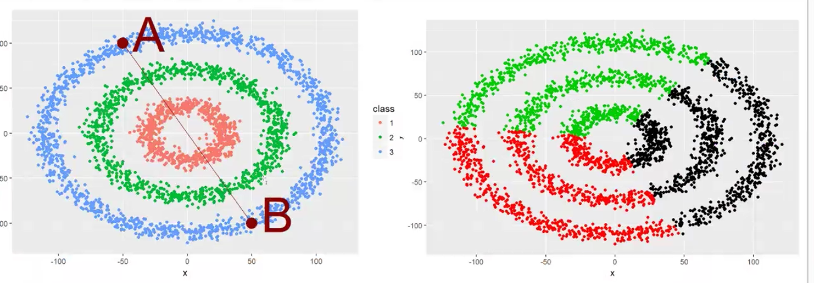

## Regression (quantitatif)

### Corrélation de Pearson (quantitatif)

**Mesure la relation linéaire entre deux variables numériques.**

Lorsqu’on entraîne un modèle de régression, on cherche à prédire une variable continue (ex: prix d’une maison, température, chiffre d'affaires, etc.)

La corrélation de Pearson (𝑟) mesure le degré de linéarité entre les prédictions et les valeurs réelles : 

- Si 𝑟 est proche de 1 → Le modèle suit bien la tendance des données réelles.
- Si 𝑟 est proche de 0 → Aucune corrélation linéaire entre les prédictions et les valeurs réelles (le modèle est mauvais).
- Si 𝑟 est négatif → Les prédictions sont à l'opposé des valeurs réelles (erreur systématique).

En complément des erreurs absolues (comme RMSE et MAE), la corrélation de Pearson aide à voir si le modèle suit la bonne dynamique générale.
 

### RSS (Residual Sum of Squares)

*Le résidu rpz l'erreur pour chacune des prédictions.*

C’est la somme des erreurs élevées au carré. Plus le RSS est faible, plus le modèle ajuste bien les données.

Ne permet pas de comparer des modèles entre différents jeux de données, car sa valeur dépend de la taille de l’échantillon.

### MSE (Mean Squared Error)

✅ Comparaison des performances d’un modèle entre différents jeux de test ou algorithmes.

✅ Permet de choisir la meilleure optimisation ou le meilleur kernel (par exemple en SVM ou régression).

❌ Problème : l’unité du MSE n’est pas la même que celle de la variable cible 
𝑌.

### RMSE (Root Mean Squared Error)

✅ Permet d’avoir une erreur interprétable car elle est dans la même unité que 
𝑌.

✅ Très utile pour comparer des modèles de régression et voir l’ampleur des erreurs en unités réelles.

❌ Ne fonctionne PAS pour des prédictions qualitatives ! (À corriger dans tes notes) → Il est exclusivement utilisé en régression et non en classification.

## Clustering 

*comparer un individu avec un autre => clustering, call non supervisé*

>Non supervisé, j'ai un jeu de données et je n'ai aucune idée de comment comparer ces individu. C'est une première étape pour classifier un jeu de données préscis. 

## Classification 

déterminé qu'un indiv. appartient à une class => classification 

>Ici on a des données par le métier, on a une colonne qui devra être déterminer, es ce que l'individu appartient à la class A ou B, malade pas malade, toxic, comestible. 

## Régression 

déterminé les caractéristique d'un individu => régression 

> La colonne a déterminer est réel avec une infinité de valeur, elle n'est pas sur deux modalité. 

Classification => variable qualitative 

Régression => variable quantitative 

# 🔹 K-Means (Lloyd)

Le **K-Means** est un **algorithme de clustering** qui regroupe les données en **K groupes homogènes**. Il repose sur la notion de **barycentre** et fonctionne de manière itérative pour minimiser la distance intra-classe.  

---

## ⚙️ 1️⃣ Fonctionnement de K-Means  

📌 **Étapes principales :**  
1. **Définir aléatoirement** deux points de départ (appelés **centroïdes**).  
2. **Calculer les distances** de chaque individu par rapport à ces points.  
3. **Déplacer les centroïdes** vers le **barycentre** des classes obtenues.  
4. **Répéter l’opération** jusqu’à ce qu’il n’y ait plus de variation entre deux itérations.  

📌 **Deux versions possibles :**  
- **Démarrage avec 2 individus existants**.  
- **Démarrage avec 2 points totalement aléatoires**.  

🔴 **Problème possible :**  
L’algorithme peut **ne pas converger** si les classes ne sont pas bien définies, ce qui peut le faire **tourner en boucle**.  

---

## 🎯 2️⃣ Déterminer le Nombre Optimal de Classes  

📌 **Méthodes utilisées :**  
1️⃣ **Tester toutes les classifications possibles** et comparer les résultats.  
2️⃣ **Utiliser l’indice de silhouette** pour choisir la meilleure segmentation.  

📌 **Méthode de la silhouette :**  
- Pour **chaque individu**, on calcule :  
  1. La **distance moyenne** entre lui-même et tous les individus de **sa propre classe**.  
  2. La **distance moyenne** entre lui-même et tous les individus d’une **autre classe**.  
- On analyse si un individu **aurait été mieux placé dans une autre classe**.  
- On cherche **où la distance est minimale** :  
  - **Si la distance intra-classe est plus faible** → Bonne classification ✅  
  - **Si la distance avec une autre classe est plus faible** → Mauvaise classification ❌  

---

## ⚠️ 3️⃣ Limites de la Méthode de la Silhouette  

> **La silhouette ne fonctionne pas dans tous les cas !**  

📌 **Cas où elle échoue :**  
- Lorsque les **groupes s’emboîtent** (ex: **des cercles imbriqués**).  
- Dans ces cas, un point en **bordure d’un cercle** sera **plus proche du centre d’un autre cercle** que d’un point éloigné dans son propre cluster.  

📌 **Illustration :**  
  

---

## 🔄 4️⃣ K-Means pour la Réduction de la Complexité  

📌 **Autre usage important :**  
- **K-Means permet de réduire le nombre de valeurs** en diminuant la complexité des données.  
- **Principe** : En **créant des clusters**, on peut **attribuer de nouveaux individus à des groupes prédéfinis**.  
- **Avantage** :  
  - Même si **aucune information n’est créée**, on **ajoute artificiellement des valeurs**, ce qui améliore le comportement des algorithmes de classification.  

---

## 📌 5️⃣ Normalisation des Données  

💡 **Règle fondamentale :**  
✅ **K-Means ne fonctionne bien que sur des colonnes centrées et réduites.**  
✔ Cela évite qu’une **variable avec une échelle plus grande** (ex: **salaire en euros vs âge en années**) **domine le calcul des distances**.  
