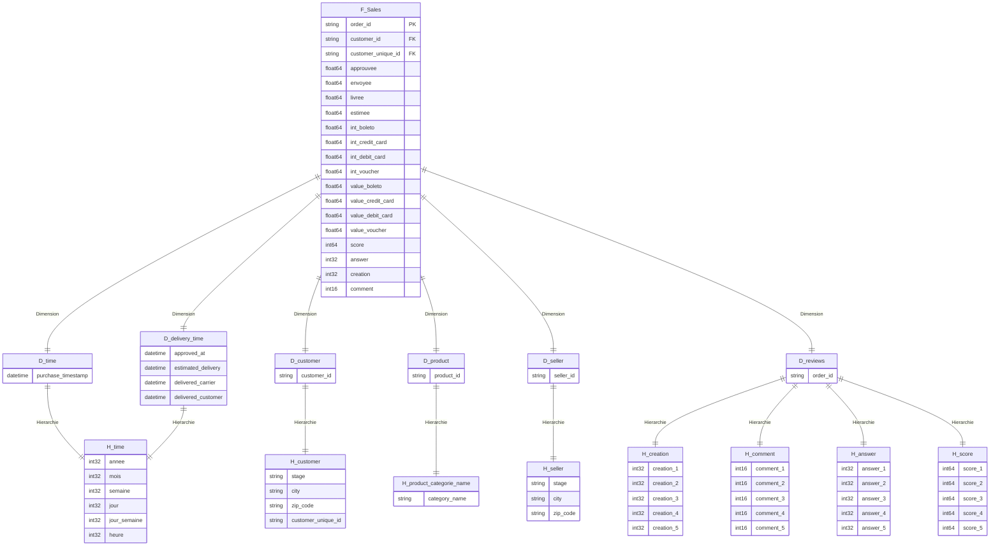
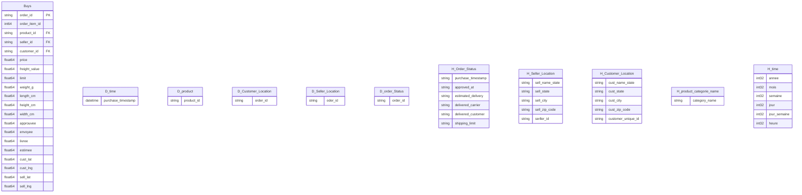
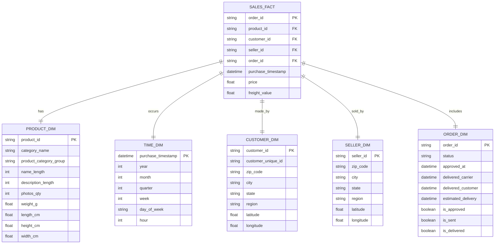
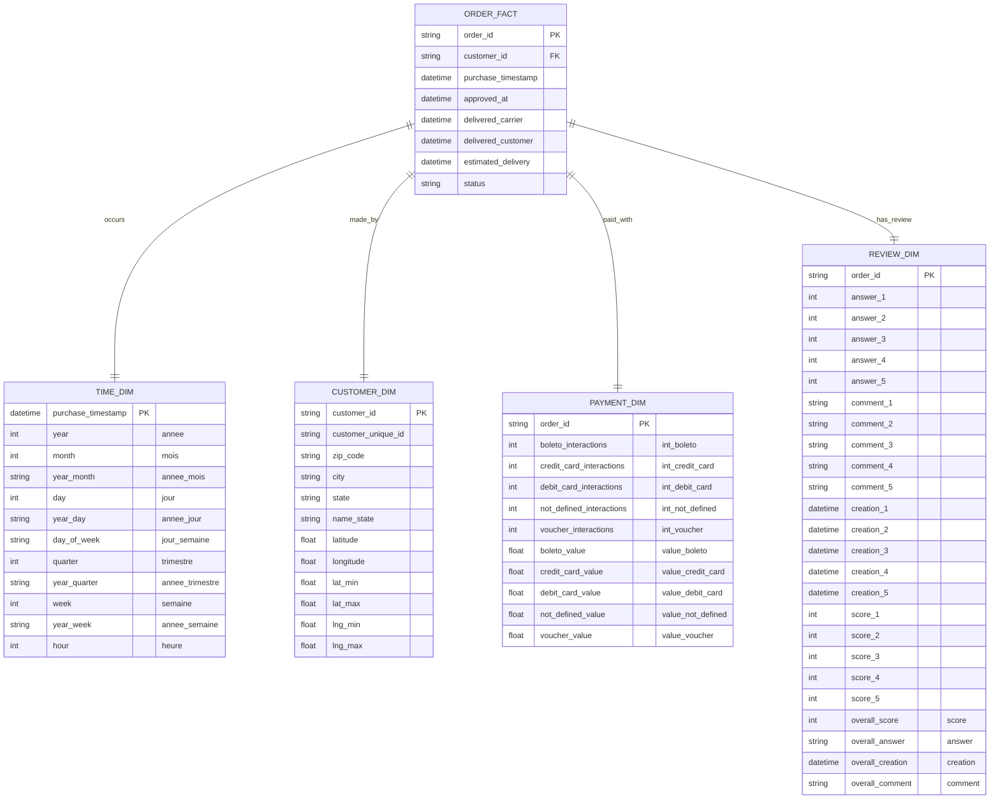

## Star model on sales :

```mermaid
erDiagram

    D_time          ||--|| H_time                    : Hierarchie
    D_delivery_time ||--|| H_time                    : Hierarchie
    D_customer      ||--|| H_customer                : Hierarchie
    D_product       ||--|| H_product_categorie_name  : Hierarchie
    D_seller        ||--|| H_seller                  : Hierarchie
    D_reviews       ||--|| H_creation                : Hierarchie
    D_reviews       ||--|| H_comment                 : Hierarchie
    D_reviews       ||--|| H_answer                  : Hierarchie
    D_reviews       ||--|| H_score                   : Hierarchie


    
    F_Sales           ||--|| D_time                    : Dimension
    F_Sales           ||--|| D_delivery_time           : Dimension
    F_Sales           ||--|| D_customer                : Dimension
    F_Sales           ||--|| D_product                 : Dimension
    F_Sales           ||--|| D_seller                  : Dimension
    F_Sales           ||--|| D_reviews                 : Dimension


    F_Sales {
 
        string order_id PK    
        string customer_id FK
        string customer_unique_id FK


        float64 approuvee            
        float64 envoyee             
        float64 livree               
        float64 estimee             

        float64 int_boleto          
        float64 int_credit_card     
        float64 int_debit_card      
        float64 int_voucher         
        float64 value_boleto        
        float64 value_credit_card   
        float64 value_debit_card    
        float64 value_voucher       


        int64 score               
        int32 answer              
        int32 creation            
        int16 comment             
    }

    D_time { 
        datetime purchase_timestamp
    }


    D_delivery_time {
        datetime approved_at
        datetime estimated_delivery
        datetime delivered_carrier
        datetime delivered_customer
    }

    D_customer {
        string customer_id
    }

    D_seller {
        string seller_id
    }

    D_product {
        string product_id
    }

    D_reviews {
        string order_id
    }

    H_seller {
        string stage
        string city
        string zip_code
    }

    H_customer {
        string stage
        string city
        string zip_code
        string customer_unique_id
    }

    H_score {
        int64 score_1
        int64 score_2
        int64 score_3
        int64 score_4
        int64 score_5
    }

    H_answer {
        int32 answer_1
        int32 answer_2
        int32 answer_3
        int32 answer_4
        int32 answer_5
    }

    H_comment {
        int16 comment_1
        int16 comment_2
        int16 comment_3
        int16 comment_4
        int16 comment_5
    }

    H_creation {
        int32 creation_1
        int32 creation_2
        int32 creation_3
        int32 creation_4
        int32 creation_5
    }


    H_product_categorie_name {
        string category_name
    }

    H_time {
        int32 annee
        int32 mois
        int32 semaine
        int32 jour
        int32 jour_semaine
        int32 heure
    }

```

## Star model on Buy 

```mermaid
erDiagram

    Buys {
        string order_id PK       
        int64 order_item_id        
        string product_id FK      
        string seller_id FK    
        string customer_id FK


        float64 price                
        float64 freight_value        
        float64 limit                
        

        float64 weight_g             
        float64 length_cm           
        float64 height_cm           
        float64 width_cm            


        float64 approuvee           
        float64 envoyee             
        float64 livree              
        float64 estimee             

        float64 cust_lat            
        float64 cust_lng            
        float64 sell_lat            
        float64 sell_lng            
    
    }

    D_time { 
        datetime purchase_timestamp
    }

    D_product {
        string product_id
    }

    D_Customer_Location {
        string order_id
    }

    D_Seller_Location { 
        string oder_id
    }

    D_order_Status { 
        string order_id
    }

    H_Order_Status { 
        string purchase_timestamp
        string approved_at
        string estimated_delivery
        string delivered_carrier
        string delivered_customer
        string shipping_limit   
    }

    H_Seller_Location {
        string sell_name_state
        string sell_state
        string sell_city
        string sell_zip_code
        string serller_id
    }

    H_Customer_Location { 
        string cust_name_state
        string cust_state
        string cust_city
        string cust_zip_code
        string customer_unique_id
    }


    H_product_categorie_name {
        string category_name
    }


    H_time {
        int32 annee
        int32 mois
        int32 semaine
        int32 jour
        int32 jour_semaine
        int32 heure
    }

    


```

```mermaid
erDiagram
    SALES_FACT ||--|| PRODUCT_DIM : has
    SALES_FACT ||--|| TIME_DIM : occurs
    SALES_FACT ||--|| CUSTOMER_DIM : made_by
    SALES_FACT ||--|| SELLER_DIM : sold_by
    SALES_FACT ||--|| ORDER_DIM : includes


    SALES_FACT {
        string order_id PK
        string product_id FK
        string customer_id FK
        string seller_id FK
        string order_id FK
        datetime purchase_timestamp
        float price
        float freight_value
    }

    PRODUCT_DIM {
        string product_id PK
        string category_name
        string product_category_group
        int name_length
        int description_length
        int photos_qty
        float weight_g
        float length_cm
        float height_cm
        float width_cm
    }

    TIME_DIM {
        datetime purchase_timestamp PK
        int year
        int month
        int quarter
        int week
        string day_of_week
        int hour
    }

    CUSTOMER_DIM {
        string customer_id PK
        string customer_unique_id
        string zip_code
        string city
        string state
        string region
        float latitude
        float longitude
    }

    SELLER_DIM {
        string seller_id PK
        string zip_code
        string city
        string state
        string region
        float latitude
        float longitude
    }

    ORDER_DIM {
        string order_id PK
        string status
        datetime approved_at
        datetime delivered_carrier
        datetime delivered_customer
        datetime estimated_delivery
        boolean is_approved
        boolean is_sent
        boolean is_delivered
    }
```

Star model on purchases :

```mermaid
erDiagram
    ORDER_FACT ||--|| TIME_DIM : occurs
    ORDER_FACT ||--|| CUSTOMER_DIM : made_by
    ORDER_FACT ||--|| PAYMENT_DIM : paid_with
    ORDER_FACT ||--|| REVIEW_DIM : has_review

    ORDER_FACT {
        string order_id PK
        string customer_id FK
        datetime purchase_timestamp
        datetime approved_at
        datetime delivered_carrier
        datetime delivered_customer
        datetime estimated_delivery
        string status
    }

    TIME_DIM {
        datetime purchase_timestamp PK
        int year "annee"
        int month "mois"
        string year_month "annee_mois"
        int day "jour"
        string year_day "annee_jour"
        string day_of_week "jour_semaine"
        int quarter "trimestre"
        string year_quarter "annee_trimestre"
        int week "semaine"
        string year_week "annee_semaine"
        int hour "heure"
    }

    CUSTOMER_DIM {
        string customer_id PK
        string customer_unique_id
        string zip_code
        string city
        string state
        string name_state
        float latitude
        float longitude
        float lat_min
        float lat_max
        float lng_min
        float lng_max
    }

    PAYMENT_DIM {
        string order_id PK
        int boleto_interactions "int_boleto"
        int credit_card_interactions "int_credit_card"
        int debit_card_interactions "int_debit_card"
        int not_defined_interactions "int_not_defined"
        int voucher_interactions "int_voucher"
        float boleto_value "value_boleto"
        float credit_card_value "value_credit_card"
        float debit_card_value "value_debit_card"
        float not_defined_value "value_not_defined"
        float voucher_value "value_voucher"
    }

    REVIEW_DIM {
        string order_id PK
        int answer_1
        int answer_2
        int answer_3
        int answer_4
        int answer_5
        string comment_1
        string comment_2
        string comment_3
        string comment_4
        string comment_5
        datetime creation_1
        datetime creation_2
        datetime creation_3
        datetime creation_4
        datetime creation_5
        int score_1
        int score_2
        int score_3
        int score_4
        int score_5
        int overall_score "score"
        string overall_answer "answer"
        datetime overall_creation "creation"
        string overall_comment "comment"
    }

```