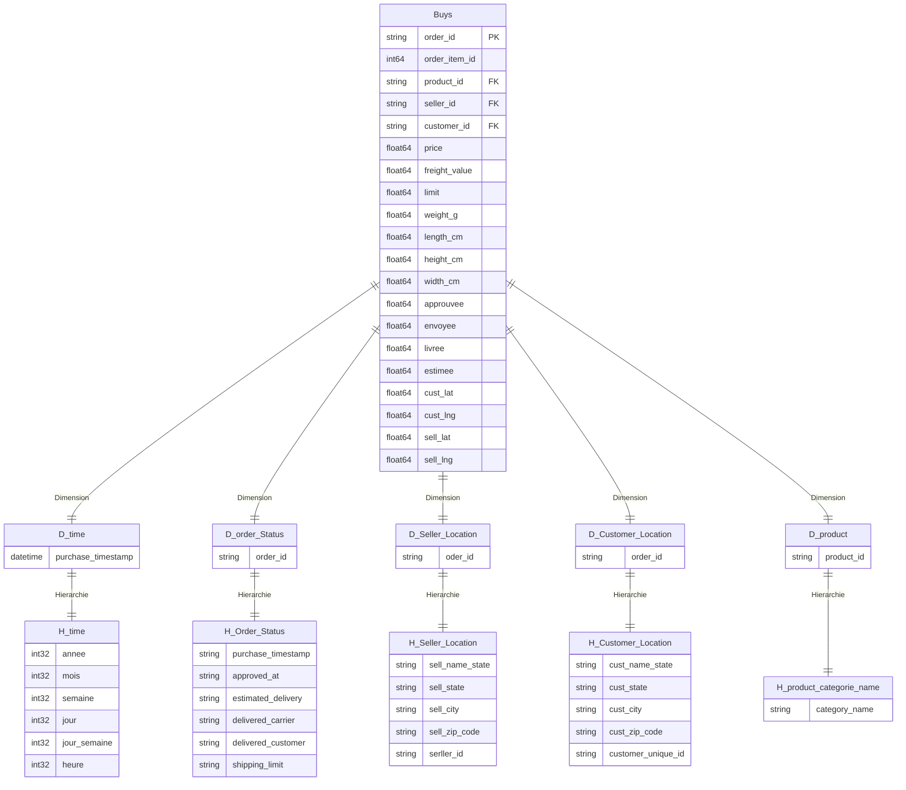

## Star model on Buy 

```mermaid
erDiagram

    Buys                ||--|| D_time                    : Dimension
    Buys                ||--|| D_order_Status            : Dimension
    Buys                ||--|| D_Seller_Location         : Dimension
    Buys                ||--|| D_Customer_Location       : Dimension
    Buys                ||--|| D_product                 : Dimension


    D_time              ||--|| H_time                    : Hierarchie
    D_order_Status      ||--|| H_Order_Status            : Hierarchie
    D_Seller_Location   ||--|| H_Seller_Location         : Hierarchie
    D_Customer_Location ||--|| H_Customer_Location       : Hierarchie
    D_product           ||--|| H_product_categorie_name  : Hierarchie


    Buys {
        string order_id PK       
        int64 order_item_id        
        string product_id FK      
        string seller_id FK    
        string customer_id FK


        float64 price                
        float64 freight_value        
        float64 limit                
        

        float64 weight_g             
        float64 length_cm           
        float64 height_cm           
        float64 width_cm            


        float64 approuvee           
        float64 envoyee             
        float64 livree              
        float64 estimee             

        float64 cust_lat            
        float64 cust_lng            
        float64 sell_lat            
        float64 sell_lng            
    
    }

    D_time { 
        datetime purchase_timestamp
    }

    D_product {
        string product_id
    }

    D_Customer_Location {
        string order_id
    }

    D_Seller_Location { 
        string oder_id
    }

    D_order_Status { 
        string order_id
    }

    H_Order_Status { 
        string purchase_timestamp
        string approved_at
        string estimated_delivery
        string delivered_carrier
        string delivered_customer
        string shipping_limit   
    }

    H_Seller_Location {
        string sell_name_state
        string sell_state
        string sell_city
        string sell_zip_code
        string serller_id
    }

    H_Customer_Location { 
        string cust_name_state
        string cust_state
        string cust_city
        string cust_zip_code
        string customer_unique_id
    }


    H_product_categorie_name {
        string category_name
    }


    H_time {
        int32 annee
        int32 mois
        int32 semaine
        int32 jour
        int32 jour_semaine
        int32 heure
    }

    
```